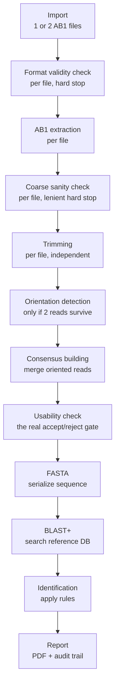

# PAIGS WildID — Build Plan

Sep 20, 2026 · @QA Engineer

An independently-built, stage-by-stage pipeline that turns a raw wildlife DNA sequencer file into an auditable species-identification report, with a Run/Stage model that lets an analyst stop, resume, and review any step from the UI.

## Architecture overview

The system is split into two independent pieces that talk over an API: a **backend** that owns every decision, and a **frontend** that only displays and triggers.

- **Backend (Python + FastAPI):** owns the pipeline, the rules, the database, and report generation. Nothing that affects a result lives in the UI.
- **Frontend (React SPA):** uploads files, shows results stage by stage, and lets an analyst edit configuration (thresholds, markers). It never computes anything itself.
- **External tool (BLAST+):** a separate program, not a Python library, invoked by the backend as a subprocess to do the actual sequence-matching search.

Each unit of work is a **Run** (one analyst's attempt to identify one sample, from either one or two AB1 files) made of ordered **Stages**: Import, Format Validity Check, AB1 Extraction, Coarse Sanity Check, Trimming, Orientation Detection, Consensus Building, Usability Check, FASTA, BLAST, Identification, Report. Every stage is a row in the database with its own status and stored output — this is what makes stop/resume and back-and-forth review possible from the UI, covered in full in the Run/Stage section below.



Each box above is one **Stage** record: it has a defined input, a defined output, a status (pending / running / completed / failed), and it persists independently so any stage can be opened and reviewed without re-running the ones before or after it.

## Bioinformatics glossary

| Term | Plain-language meaning |
| --- | --- |
| AB1 file | The raw binary output file of a Sanger-sequencing machine; contains the inferred DNA sequence plus a per-base confidence score. |
| Sanger sequencing | The lab technique that reads a DNA sample base-by-base and produces the AB1 file; less accurate at the start and end of a read. |
| Nucleotide / base | One letter of DNA: A, T, G, or C. A "sequence" is just a string of these letters. |
| Phred quality score | A per-base confidence number from the sequencer; higher means more certain that base was read correctly. |
| N base / ambiguous base | A position where the sequencer could not confidently call a letter; recorded as "N" instead of A/T/G/C. |
| Trimming | Removing the low-confidence stretches at the start and/or end of a sequence before using it. |
| FASTA | A plain-text, near-universal file format for representing one or more DNA/protein sequences (a ">" header line followed by the sequence letters). |
| Reference database | A curated collection of known, verified sequences (one per species/marker) that a query sequence is compared against. |
| Accession number | A unique ID for one reference sequence, often traceable to a public repository such as NCBI GenBank. |
| DNA marker (e.g. COI) | A specific, standardized region of the genome chosen for identification because it varies enough between species to be diagnostic; different markers can need different thresholds. |
| BLAST (Basic Local Alignment Search Tool) | The standard algorithm/program for finding the best approximate matches between a query sequence and a reference database, allowing for mismatches and gaps rather than requiring an exact match. |
| Alignment | The line-up BLAST finds between the query sequence and a reference sequence, marking which positions match. |
| Identity (%) | Of the aligned region, the percentage of bases that matched exactly. |
| Coverage (%) | What percentage of the query sequence was actually included in the alignment; a short match on a long query is weaker evidence. |
| E-value | The statistical likelihood that an alignment this good happened purely by chance; lower is stronger evidence of a real match. |
| Bit score | A normalized score of alignment quality, useful for comparing hits to each other. |
| Taxonomy / taxonomic consistency | An organism's classification (species, genus, family, etc.); a "taxonomically inconsistent" result is one where the top matches don't make biological sense together. |
| Forensic / evidentiary use | Use of a result as evidence in a legal or investigative context, which is why every step here must be reproducible and auditable, not just "an answer." |
| Read | One pass of the sequencer, producing one AB1 file; identified by which primer was used to start it. |
| Primer (forward / reverse) | A short synthetic sequence the machine uses to know where to start reading; a forward and reverse primer read the same DNA fragment from opposite ends. |
| Complementary strand | DNA's two strands pair base-for-base (A-T, G-C) and run in opposite directions; forward and reverse reads cover the same region from each strand. |
| Reverse complement | A mechanical operation: reverse a sequence's order and swap each base for its pair (A<->T, G<->C); used to bring two opposite-direction reads into the same orientation. |
| Consensus sequence | A single higher-confidence sequence built by comparing two overlapping reads and picking the more reliable base at each position. |
| Contig | Short for "contiguous sequence" — here, the consensus sequence assembled from a forward+reverse read pair. |
| Pairwise alignment | Algorithmic comparison of two sequences to find where they best line up, allowing for small mismatches; the basis for detecting read orientation and building a consensus. |

## Stage 0 — Import

**What happens:** the analyst uploads into two labeled slots, **"Forward Read"** and **"Reverse Read"**. Both single-file and two-file are equally valid, first-class entry points — a single file is not a degraded fallback of the two-file case, it's the path the original brief describes, and the pipeline supports it fully. The system does not require the labels to be correct; which file is truly forward and which is reverse is confirmed later, in Orientation Detection (Stage 5) — a label/detected mismatch is only ever noted, never blocking. The system creates a new **Run** record immediately, before any processing starts.

**Labeling:** the sample label pre-fills from the filename(s) with a timestamp appended at the moment upload begins (e.g. `WILD_001_2026-09-20T14-32`), editable by the analyst at any time.

**Output:** the original AB1 file(s) stored permanently and untouched, plus a Run record: `{ run_id, sample_id, original_filenames: [file_a] or [file_a, file_b], created_at, current_stage: "import", status: "completed" }`.

**Why it's its own stage, not a pre-step:** a failed or abandoned upload should still show up in the analyst's run history as an incomplete run — nothing here is transient.

## Stage 1 — Format validity check

**What happens:** a hard stop, and deliberately the very first check — before anything about read quality is even considered. Is each uploaded file a **structurally valid AB1 file** at all: can it be opened and parsed, is it not corrupted, does it have the internal structure an AB1 file is supposed to have? This is a yes/no question about file integrity, unrelated to how good the DNA read itself is.

**Tool:** Biopython's `Bio.SeqIO` — attempting the parse itself is the check; a parse failure is the fail condition.

**Input:** the stored AB1 file(s) from Stage 0.

**Output:** `{ file_a: { valid: true }, file_b: { valid: true } }` (or `valid: false` with a reason). A file failing here is rejected immediately with a specific, plain-language message — never silently passed through.

## Stage 2 — AB1 extraction

**What happens:** for each file that passed Stage 1, the backend parses the sequence and per-base quality scores out of the binary AB1 structure. No judgment is applied yet — this is pure extraction, run once per file.

**Tool:** Biopython's `Bio.SeqIO`, which has a built-in AB1 parser.

**Input:** the format-valid AB1 file(s) from Stage 1.

**Output:** one extraction result per file, e.g. `{ read_a: { raw_sequence: "ATGCTAGC...", raw_length: 812, quality_scores: [...] } }` (and `read_b` if a second file was provided).

## Stage 3 — Coarse sanity check

**What happens:** a second hard stop, but a deliberately **lenient** one — it exists only to catch genuinely broken reads, not the normal noisy edges every raw Sanger read has. Checks per file: is there any real signal at all (not almost entirely `N`, the code for a completely unreadable position), is the raw length above an absurdly-low floor. This is *not* the real accept/reject decision for the sample — that happens later, in Stage 7, after cleanup.

**Rules to configure (with domain experts, not guessed):**

- Maximum proportion of `N` bases tolerated in the raw read
- Minimum raw read length

**Tool:** NumPy for the simple proportions/counts involved.

**Input:** Stage 2's extracted read(s).

**Output:** per file, e.g. `{ read_a: { n_proportion: 0.01, raw_length: 812, status: PASS } }`.

**Branching — what happens with two files if one fails here:**

| Case | Outcome |
| --- | --- |
| Both reads PASS | Proceed to Trimming on both, then Orientation Detection + Consensus Building |
| One read PASSes, the other FAILs | Proceed with the passing read alone, single-read path from here on; report flags `single_read_reason: "qc_failure"` |
| Both reads FAIL | Run stops here |
| Only one file was ever uploaded and it PASSes | Proceeds as a deliberate single-read run; report flags `single_read_reason: "single_file_provided"` |

## Stage 4 — Trimming

**What happens:** sequencers are least reliable at the leading and trailing ends of a read — a known, physical limitation of Sanger sequencing, not a defect in any particular sample. This stage runs on each sanity-checked read **independently, before the two reads are ever compared to each other** — using the per-base Phred quality scores, it finds where the reliable stretch of the read begins and ends, and cuts off everything outside that window.

**Why order matters here:** trimming has to happen before Orientation Detection and Consensus Building, not after — comparing two reads while their noisy raw edges are still attached risks the alignment being thrown off by exactly the parts that are least trustworthy.

**Why it must be logged, not just applied silently:** trimming changes the exact data that later gets compared against the reference database, so the parameters used need to be part of the audit trail.

**Tool:** simple logic over the quality scores already extracted — no new library needed.

**Rules to configure:** the quality threshold defining the "reliable window," and a minimum window size below which a read is treated as having nothing left to keep.

**Input:** each sanity-checked read from Stage 3.

**Output:** per file, e.g. `{ read_a: { trimmed_sequence: "ATCGATCG...", trimmed_length: 694, trim_params: { quality_threshold: 20 } } }`.

## Stage 5 — Orientation detection

**Only runs when two reads survived Trimming.** A forward and reverse read cover the same physical DNA fragment but from opposite ends, reading opposite strands — so before they can be compared, the system needs to know which orientation each is actually in.

**What happens:** the system attempts a pairwise alignment of the two trimmed reads as-is, and separately with one reverse-complemented (reversed order, each base swapped for its pair: A↔T, G↔C). Whichever attempt produces a strong overlap reveals the correct orientation — a deterministic check, not a guess. This is entirely independent of which upload slot each file was placed in: if the analyst's "Forward"/"Reverse" labels turn out to disagree with what's actually detected, that's recorded as `label_orientation_mismatch: true` and shown to the analyst as a plain informational note — it never blocks the run, since nothing about the science was actually wrong.

**Tool:** Biopython's `Bio.Align.PairwiseAligner` — sufficient for short Sanger reads; no need for heavyweight genome-assembly tools.

**Input:** Stage 4's two trimmed reads.

**Output:** `{ orientation: "read_b_reverse_complemented", alignment_score: 812, overlap_length: 780, label_orientation_mismatch: false }`. If neither orientation produces a usable overlap, the run flags for review rather than guessing — this most often means the two files aren't actually a matching pair.

## Stage 6 — Consensus building

**What happens:** with both reads in the same orientation, the system aligns them position by position and builds one merged sequence — picking the more trustworthy base at each spot:

- Both reads agree → keep it.
- They disagree → compare Phred quality scores at that position, keep the more confident one.
- One read gives a confident, definite base and the other gives an **IUPAC ambiguity code** (a standard code meaning "it's one of these options," e.g. `W` = "A or T") that's consistent with the confident call → the definite base wins.
- Both confident but genuinely disagree → flagged as an ambiguous position for the analyst, never silently resolved.

**Tool:** built on the same `Bio.Align` alignment from Stage 5; the consensus logic itself is straightforward per-position comparison, plus a small IUPAC code lookup table.

**Input:** Stage 5's oriented read pair.

**Output:** `{ consensus_sequence: "ATCGATCG...", consensus_length: 780, ambiguous_positions: [] }`.

## Stage 7 — Usability check

**What happens:** this is the real accept/reject gate for the sample — replacing what used to be a single upfront quality check. It runs on whatever actually survived cleanup: the consensus sequence (two-read path) or the single trimmed read (single-read path, whether that's because only one file was uploaded or the other failed Stage 3). The question here is deliberately different from Stage 3's: not "was the raw input catastrophically bad," but "is what we're about to search good enough to trust."

**Rules to configure:**

- Minimum length of the surviving sequence
- Minimum mean quality of the surviving sequence
- Maximum unresolved ambiguous positions tolerated (two-read path only)

**Input:** Stage 6's consensus sequence, or Stage 4's single trimmed read.

**Output:** `{ final_length: 780, mean_quality: 33.4, ambiguous_positions: 0, status: PASS }`. A `FAIL` here ends the run — this is the point where a sample is genuinely judged not worth searching, based on the cleaned-up result rather than the raw upload.

## Stage 8 — FASTA generation

**What happens:** a pure format-conversion step. The sequence that passed Stage 7 is written into FASTA, the standard text format nearly every bioinformatics tool (including BLAST) expects as input.

**Tool:** Biopython's `Bio.SeqIO`, for writing this time.

**Input:** Stage 7's usable sequence.

**Output:** a `.fasta` file, e.g.:

```
>WILD_001
ATCGATCGATCGATCGATCGATCG
```

## Stage 9 — BLAST comparison

**What happens:** the FASTA sequence is searched against a curated reference database of known species sequences. BLAST finds the best approximate alignments, allowing for mismatches and gaps, since DNA between related species is never identical.

**How it's invoked:** BLAST+ is a separate compiled program, not a Python package — the backend installs it on the server and calls it as a subprocess (Biopython's `Bio.Blast.Applications` can wrap this call). The server/Docker image needs the BLAST+ binary baked in, not just listed in `requirements.txt`.

**The reference database:** built ahead of time from a curated FASTA file of known species (species/taxonomy, sequence, accession number, source, database version) using BLAST's `makeblastdb` tool, versioned separately from the app's own database — the version used must be recorded per run.

**Rules to configure:** the maximum number of ranked candidate hits kept for Stage 10 to evaluate (`max_hits`).

**Input:** Stage 8's FASTA file + the current reference database.

**Output:** a ranked list of candidate hits, e.g.:

| Rank | Species | Identity | Coverage | E-value | Bit score | Accession |
| --- | --- | --- | --- | --- | --- | --- |
| 1 | Panthera leo | 99.71% | 98.2% | 0 | 1240 | REF001 |
| 2 | Panthera pardus | 94.10% | 96.7% | 1e-90 | 980 | REF002 |
| 3 | Panthera tigris | 93.80% | 95.9% | 2e-88 | 965 | REF003 |

## Stage 10 — Identification engine

**What happens:** the ranked BLAST hits are run through a rules layer that decides a final category. The top hit is never taken at face value.

**Who defines the rules:** the domain experts, not invented by the engineering team. Thresholds live in configuration, not code — see "Configuration model" below.

**Possible outcomes:**

- **PASS** — top match clearly clears the thresholds and no other candidate is close
- **AMBIGUOUS** — multiple candidates score close together
- **REVIEW REQUIRED** — thresholds aren't met, or the result looks taxonomically inconsistent

**Input:** Stage 9's ranked hit list + the run's active threshold configuration.

**Output:** `{ candidate_species: "Panthera leo", identity: 99.71, coverage: 98.2, status: "PASS", thresholds_applied: {...} }`.

## Stage 11 — Reporting

**What happens:** every prior stage's data is assembled into one auditable report — sample ID, format/sanity results, trimming applied, orientation outcome (including any label mismatch), consensus conflicts if any, the usability decision, reference DB version, every BLAST candidate's scores, thresholds used, final status, and stated limitations (e.g. "expert-assistance result, not a standalone forensic conclusion").

**Tool:** ReportLab (or WeasyPrint) to generate the PDF.

**Input:** the stored output of every prior stage for this Run.

**Output:** one PDF report per run, plus a database record of the report for later retrieval.

## Configuration model

Thresholds live in a config table with sensible starting defaults (pending real domain review) for: Stage 3's sanity thresholds, Stage 4's trim quality threshold, Stage 7's usability thresholds, Stage 9's maximum number of ranked BLAST hits kept, and Stage 10's identity/coverage thresholds (potentially per DNA marker or species).

- **Global defaults** apply unless overridden.
- **Before starting a run**, the analyst can review and override the defaults for that specific run — the values actually used are a deliberate choice at the point of analysis, not silently inherited.
- **After a run completes, for MVP:** trying different settings means triggering a **whole new Run** — same uploaded file(s), adjusted configuration — rather than editing or re-running any piece of the original. The two Runs sit side by side, fully independent and comparable; nothing about the original is ever touched. Stage-level partial re-runs are not part of the MVP.

## Validation

A product capability, not just a development practice — lab staff can run this themselves, anytime, against a batch of samples with already-known correct answers, to check the pipeline is behaving.

A **Validation Batch** is a set of Runs, each tagged with an `expected_species` value the pipeline never sees or uses for anything except final scoring. Two modes:

- **Known samples** — expected answers known upfront; mainly useful during development to sanity-check behavior.
- **Blinded set** — expected answers withheld from whoever runs the batch until after scoring, specifically to prevent unconsciously tuning thresholds to pass known answers.

**Output — a scorecard** covering exactly what the brief asks for: correct / incorrect / ambiguous / review-required rates, reproducibility (does the same input, run twice, give the same result), and processing time per sample.

## Run/Stage data model

A **Run** is the top-level entity for one analyst's attempt at identifying one sample — not the uploaded file itself:

```
Run
 ├─ id
 ├─ sample_id (editable label)
 ├─ original_filename
 ├─ created_at
 ├─ current_stage
 └─ status: in_progress | paused | completed | failed
```

Each **Stage** is its own persisted row, not a transient function call:

```
Stage
 ├─ run_id
 ├─ stage_type: import | format_check | ab1_extraction | sanity_check | trim | orientation | consensus | usability_check | fasta | blast | identification | report
 ├─ status: pending | running | completed | failed | skipped
 ├─ input_ref (usually the previous stage's output)
 ├─ output (the stored result)
 ├─ started_at / completed_at
 └─ metadata (thresholds used, versions, anything audit-relevant)
```

**This is what makes stop/resume and free navigation possible:** the run simply sits at `current_stage` until someone triggers the next one — nothing forces stages to chain automatically. Every completed stage's output is a stored row, so reviewing an earlier step is just a read, not a recomputation.

**Immutability rule:** a stage's output, once written, is never overwritten. For MVP, there is no stage-level re-run: if an analyst wants to see how a result would change under different configuration, they trigger a **whole new Run** using the same uploaded file(s) (see `POST /runs/{id}/rerun` below) — the original Run is untouched, and the two Runs sit side by side for direct comparison.

## UI flow

The UI behaves as a **tab-based inspector**, not a forced linear wizard:

- A stepper/rail lists all stages with a status icon each: done, in progress, pending, or failed.
- Uploading triggers the entire pipeline automatically — no per-stage clicking. The stepper simply advances live as each stage completes on the backend.
- Clicking any **completed** stage opens its stored output instantly, read-only — no recomputation, just a fetch of what's already persisted.
- A run in progress can be left and resumed later from a history/list view, which surfaces `current_stage` so the analyst can see how far it got.
- The backend enforces stage ordering and auto-stop conditions (invalid file, sanity-check failure, no orientation overlap, usability-check failure) — the frontend never decides when to halt.
- To try different configuration, the analyst uses `POST /runs/{id}/rerun` — a whole new Run, side by side with the original, never a modification of it.

**API shape this implies:**

```
POST   /runs                      -> create a run (upload 1 or 2 AB1 files into labeled slots, set label, optional config overrides)
POST   /runs/{id}/execute         -> run every stage through to completion automatically
POST   /runs/{id}/rerun           -> create a brand-new Run reusing this run's file(s), with new config overrides
GET    /runs                      -> list all runs (history view)
GET    /runs/{id}                 -> run summary + all stage statuses (drives the live progress stepper)
GET    /runs/{id}/stages/{type}   -> get a specific stage's stored output, read-only
PATCH  /runs/{id}                 -> rename/relabel a run
GET    /config                    -> list current threshold configs
PUT    /config/{id}               -> update a threshold config
POST   /validation-batches        -> run a batch of runs with known expected_species, get a scorecard
```

Upload triggers `POST /runs` followed immediately by `POST /runs/{id}/execute` — the default path requires no per-stage clicking, since almost every stage is mechanical with nothing for a human to decide mid-flight. The frontend polls `GET /runs/{id}` to drive the live stepper. Past stages remain individually viewable via `GET /runs/{id}/stages/{type}` at any time, instantly, with no recomputation.

### Stage-level visualizations (deferred to the frontend build)

Swagger (`/docs`) can only render raw JSON — it has no charting capability, so anything below is real frontend work (build-order step 9), not a backend or Swagger concern. Every item except the chromatogram viewer renders entirely from data the API already returns today — no new backend computation or storage, just charts over existing stage `output` fields, so none of this is a research risk to defer.

- **Trim visualization (Stage 4):** a per-base quality-score line/bar chart across the read's full raw length, with the kept window (`trim_start`–`trim_end`) shaded — makes the trimming decision visually obvious instead of three raw numbers. Data already available: Stage 2's `quality_scores`, Stage 4's `trim_start`/`trim_end`.
- **Pipeline funnel (all stages):** a simple bar/funnel chart of sequence length at each cleanup step — raw → trimmed → consensus → final — showing where and how much length was lost. Data already available: `ab1_extraction.raw_length`, `trim.trimmed_length`, `consensus.consensus_length`, `usability_check.final_length`.
- **BLAST hit comparison (Stage 9/10):** a bar chart of identity %/coverage %/bit score across the ranked hit list, with Stage 10's `ambiguous_margin_pct` threshold drawn as a reference line — makes an AMBIGUOUS verdict visually intuitive (how close the top two candidates really are) instead of just two numbers in a table. Data already available: Stage 9's full ranked `hits` list.
- **Consensus alignment view (Stage 6):** a side-by-side, position-aligned view of the two oriented reads with agreement/disagreement/ambiguous positions color-coded — shows exactly why each consensus base was called, not just the merged result. Data already available: Stage 6's `ambiguous_positions`, both reads' Stage 4 sequences/quality.
- **Rerun comparison view:** since `POST /runs/{id}/rerun` produces a sibling Run under different configuration, a side-by-side diff (identity %, coverage %, final status, key thresholds) between a Run and its `rerun_of` sibling would make "what changed when I adjusted this threshold" visible at a glance, instead of manually comparing two separate report PDFs.
- **Chromatogram viewer:** the raw four-channel fluorescence trace and per-base peak locations are already present in every stored AB1 file (Biopython's ABI parser exposes them, e.g. `DATA9`–`DATA12`, `PLOC2`, under `record.annotations["abif_raw"]`), but nothing in the pipeline currently reads or returns them. Rendering a chromatogram snippet around a flagged Stage 6 ambiguous position or a low-quality Stage 7 region would let an analyst visually verify a flagged call rather than trust the number alone — real value for a forensic/evidentiary audit trail. Unlike everything above, this needs one new backend endpoint to expose the raw trace channels first, since nothing currently returns them.

Not duplicated here: the Validation Batch scorecard's own charts (accuracy/ambiguity/review rates, reproducibility, processing time) are already covered by the Technology map's `pandas + matplotlib/Plotly` row below and the Validation section above — a separate, already-planned piece of work.

## Technology map

| Layer / stage | Technology | Role |
| --- | --- | --- |
| Backend framework | Python + FastAPI | Owns the API, request validation (via Pydantic), and orchestration |
| Frontend | React SPA | Upload, stage-by-stage results view, configuration screens |
| AB1 extraction | Biopython (`Bio.SeqIO`) | Parses the binary AB1 format into sequence + quality scores |
| QC | NumPy | Numeric checks: mean quality, quality percentages |
| Trimming + FASTA | Biopython | Removes poor-quality ends, writes standard FASTA |
| Sequence search | BLAST+ (external binary) | Approximate alignment search against the reference database |
| Results parsing/ranking | pandas | Structures and filters BLAST's hit list |
| Rules engine | Plain Python + a config table | Applies identity/coverage thresholds, taxonomic checks |
| Reporting | ReportLab or WeasyPrint | Generates the audit-trail PDF |
| Operational database | PostgreSQL (SQLite acceptable for early prototype) | Runs, Stages, configuration, report metadata |
| Reference database | BLAST's own indexed format (built via `makeblastdb`) | Curated species sequences BLAST searches against; versioned separately from the operational database |
| Orientation detection + consensus building | Biopython (Bio.Align.PairwiseAligner) | Aligns forward/reverse reads to detect orientation and merge them into a consensus sequence |
| Validation batch scoring & stats | pandas + matplotlib/Plotly | Aggregates a Validation Batch's runs into a scorecard (accuracy, ambiguity/review rates, reproducibility, processing time); covers the statistics/visualization role the original brief assigned to R |

Note: BLAST+ is a separate installed program, not a `pip install`-able package — it must be baked into the deployment image, not just listed as a Python dependency.

## Suggested build order for the prototype

Each stage has a defined input/output contract, so stages can be built and tested independently — the main risk to guard against is the seams between them, mitigated by defining each stage's schema (e.g. as a Pydantic model) before building it.

1. **Format validity check + AB1 extraction** — nothing else can be tested without real, parseable sequence data.
2. **Coarse sanity check** — depends only on extraction's output; test against known-good and known-catastrophic sample files.
3. **Trimming** — test with synthetic quality-score arrays so exact trim boundaries can be asserted, not just "it ran."
4. **Orientation detection + Consensus building** — needs a real or constructed forward/reverse pair with a known overlap; synthetic fixtures (a sequence plus its deliberately reverse-complemented, slightly mutated twin) are worth building here.
5. **Usability check** — test against outputs from step 4 that are deliberately too short or too ambiguous.
6. **BLAST integration** — tackled early relative to its position in the pipeline, since it's the highest-uncertainty piece (external binary, environment setup, database indexing).
7. **Identification/rules engine** — can be prototyped in parallel with #6 using recorded/fake BLAST output.
8. **Reporting** — aggregates every other stage's finalized schema.
9. **Run/Stage orchestration, `/execute`, `/rerun` + frontend** — wraps around everything once individual stages are proven.
10. **Validation batch scoring** — layered on top of a working Run pipeline; needs a small set of known-answer AB1 samples to test against.

Orientation Detection and Consensus Building only apply on the two-read path — the single-read path (whether by choice or by QC fallback) skips straight from Trimming to the Usability Check, and both paths converge again before FASTA generation.

For a prototype, aim for a thin, correct, end-to-end version of every stage first — placeholder thresholds, a small reference database — before deepening any single stage. Proving the seams work early is usually riskier than any one stage's internal logic.
