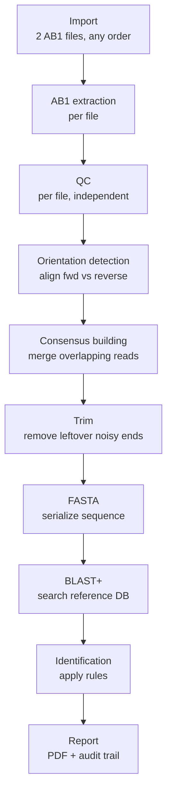

# PAIGS WildID — Build Plan

Sep 20, 2026 · @QA Engineer

An independently-built, stage-by-stage pipeline that turns a raw wildlife DNA sequencer file into an auditable species-identification report, with a Run/Stage model that lets an analyst stop, resume, and review any step from the UI.

## Architecture overview

The system is split into two independent pieces that talk over an API: a **backend** that owns every decision, and a **frontend** that only displays and triggers.

- **Backend (Python + FastAPI):** owns the pipeline, the rules, the database, and report generation. Nothing that affects a result lives in the UI.
- **Frontend (React SPA):** uploads files, shows results stage by stage, and lets an analyst edit configuration (thresholds, markers). It never computes anything itself.
- **External tool (BLAST+):** a separate program, not a Python library, invoked by the backend as a subprocess to do the actual sequence-matching search.

Each unit of work is a **Run** (one analyst's attempt to identify one sample) made of ordered **Stages**: Import, AB1 Extraction, QC, Orientation Detection, Consensus Building, Trim, FASTA, BLAST, Identification, Report. Every stage is a row in the database with its own status and stored output — this is what makes stop/resume and back-and-forth review possible from the UI, covered in full in the Run/Stage section below.



Each box above is one **Stage** record: it has a defined input, a defined output, a status (pending / running / completed / failed), and it persists independently so any stage can be opened and reviewed without re-running the ones before or after it.

## Bioinformatics glossary

| Term | Plain-language meaning |
| --- | --- |
| AB1 file | The raw binary output file of a Sanger-sequencing machine; contains the inferred DNA sequence plus a per-base confidence score. |
| Sanger sequencing | The lab technique that reads a DNA sample base-by-base and produces the AB1 file; less accurate at the start and end of a read. |
| Nucleotide / base | One letter of DNA: A, T, G, or C. A "sequence" is just a string of these letters. |
| Phred quality score | A per-base confidence number from the sequencer; higher means more certain that base was read correctly. |
| N base / ambiguous base | A position where the sequencer could not confidently call a letter; recorded as "N" instead of A/T/G/C. |
| Trimming | Removing the low-confidence stretches at the start and/or end of a sequence before using it. |
| FASTA | A plain-text, near-universal file format for representing one or more DNA/protein sequences (a ">" header line followed by the sequence letters). |
| Reference database | A curated collection of known, verified sequences (one per species/marker) that a query sequence is compared against. |
| Accession number | A unique ID for one reference sequence, often traceable to a public repository such as NCBI GenBank. |
| DNA marker (e.g. COI) | A specific, standardized region of the genome chosen for identification because it varies enough between species to be diagnostic; different markers can need different thresholds. |
| BLAST (Basic Local Alignment Search Tool) | The standard algorithm/program for finding the best approximate matches between a query sequence and a reference database, allowing for mismatches and gaps rather than requiring an exact match. |
| Alignment | The line-up BLAST finds between the query sequence and a reference sequence, marking which positions match. |
| Identity (%) | Of the aligned region, the percentage of bases that matched exactly. |
| Coverage (%) | What percentage of the query sequence was actually included in the alignment; a short match on a long query is weaker evidence. |
| E-value | The statistical likelihood that an alignment this good happened purely by chance; lower is stronger evidence of a real match. |
| Bit score | A normalized score of alignment quality, useful for comparing hits to each other. |
| Taxonomy / taxonomic consistency | An organism's classification (species, genus, family, etc.); a "taxonomically inconsistent" result is one where the top matches don't make biological sense together. |
| Forensic / evidentiary use | Use of a result as evidence in a legal or investigative context, which is why every step here must be reproducible and auditable, not just "an answer." |
| Read | One pass of the sequencer, producing one AB1 file; identified by which primer was used to start it. |
| Primer (forward / reverse) | A short synthetic sequence the machine uses to know where to start reading; a forward and reverse primer read the same DNA fragment from opposite ends. |
| Complementary strand | DNA's two strands pair base-for-base (A-T, G-C) and run in opposite directions; forward and reverse reads cover the same region from each strand. |
| Reverse complement | A mechanical operation: reverse a sequence's order and swap each base for its pair (A<->T, G<->C); used to bring two opposite-direction reads into the same orientation. |
| Consensus sequence | A single higher-confidence sequence built by comparing two overlapping reads and picking the more reliable base at each position. |
| Contig | Short for "contiguous sequence" — here, the consensus sequence assembled from a forward+reverse read pair. |
| Pairwise alignment | Algorithmic comparison of two sequences to find where they best line up, allowing for small mismatches; the basis for detecting read orientation and building a consensus. |

## Stage 0 — Import

**What happens:** the analyst uploads **two** `.ab1` files for the sample — a forward and a reverse read of the same DNA fragment. The system does not require them to be uploaded in a specific order; which file is "forward" and which is "reverse" is worked out automatically later, in Orientation Detection. The system creates a new **Run** record immediately, before any processing starts.

**Labeling:** the sample label pre-fills from the filename with a timestamp appended at the moment upload begins (e.g. `WILD_001_2026-09-20T14-32`), editable by the analyst at any time.

**Output:** both original AB1 files stored permanently and untouched, plus a Run record: `{ run_id, sample_id, original_filenames: [file_a, file_b], created_at, current_stage: "import", status: "completed" }`.

**Why it's its own stage, not a pre-step:** a failed or abandoned upload should still show up in the analyst's run history as an incomplete run — nothing here is transient.

## Stage 1 — AB1 extraction

**What happens:** the backend parses each of the two AB1 files independently, pulling out the raw sequence and per-base Phred quality scores for each. No judgment is applied yet — this is pure extraction, run twice, once per file.

**Tool:** Biopython's `Bio.SeqIO`, which has a built-in AB1 parser — no need to write binary-parsing code by hand.

**Input:** the two stored AB1 files from Stage 0.

**Output:** two extraction results, e.g. `{ read_a: { raw_sequence: "ATGCTAGC...", raw_length: 812, quality_scores: [...] }, read_b: { raw_sequence: "...", raw_length: 798, quality_scores: [...] } }`.

## Stage 2 — Quality Control (QC)

**What happens:** each of the two reads is checked **independently**, using the same rules as a single-file QC — nothing about the QC rules themselves changes. This has to happen before any alignment/consensus step: aligning a bad read against a good one wouldn't fail cleanly, it could quietly corrupt an otherwise-good consensus.

**Rules to configure (with domain experts, not guessed):**

- Minimum sequence length
- Minimum mean Phred quality score
- Maximum tolerable count of N (ambiguous) bases
- Overall pass condition — e.g. PASS / FAIL, or PASS-WITH-WARNINGS

**Tool:** NumPy for the numeric calculations (mean quality, percentage below a quality threshold).

**Input:** Stage 1's two extracted reads (raw sequence + quality scores), checked one at a time.

**Output:** one QC result per read, e.g.:

```
read_a: { mean_phred: 34.8, ambiguous_bases: 0, bases_below_q20: 21, status: PASS }
read_b: { mean_phred: 31.2, ambiguous_bases: 2, bases_below_q20: 34, status: PASS }
```

**Branching — what happens if the two reads don't agree on QC:**

| Case | Outcome |
| --- | --- |
| Both reads PASS | Proceed to Orientation Detection + Consensus Building as normal |
| One read PASSes, the other FAILs | **Default (chosen for now): single-read fallback** — proceed with the passing read alone, skip Orientation Detection and Consensus Building, go straight to Trimming/FASTA on that one read. The report carries a clear "single-read, no consensus" flag. |
| Both reads FAIL | Run stops here, same as the single-file behavior |

The single-read fallback was chosen as the default because a single good read is still usable evidence, just weaker than a consensus — common practice in real sequencing workflows. The alternative, stricter option (stop the whole run and ask for a re-upload when either read fails) remains open for the domain team to choose instead if they'd rather never report on single-read evidence.

## Stage 3 — Orientation detection

**Only runs when both reads passed QC (Stage 2).** A forward and reverse read cover the same physical DNA fragment but from opposite ends, reading opposite strands — so before they can be compared, the system needs to know which orientation each is in.

**What happens:** the system attempts a pairwise alignment of read A against read B as-is, and separately against the reverse complement of read B (reversed order, each base swapped for its pair: A<->T, G<->C). Whichever attempt produces a strong overlap tells the system the correct orientation — this is a deterministic check, not a guess, so the analyst never has to know or specify which file is forward and which is reverse.

**Tool:** Biopython's `Bio.Align.PairwiseAligner` — sufficient for short Sanger reads (hundreds of base pairs); no need for heavyweight genome-assembly tools.

**Input:** Stage 2's two QC-passed reads.

**Output:** `{ orientation: "read_b_reverse_complemented", alignment_score: 812, overlap_length: 780 }`. If neither orientation produces a usable overlap, the run flags for review rather than guessing.

## Stage 4 — Consensus building

**What happens:** with both reads in the same orientation, the system aligns them position by position and builds one merged **consensus sequence**. At every aligned position it picks the base from whichever read has higher confidence there. This matters most in the middle of a read: an end can simply be trimmed away, but a low-confidence patch in the middle can't be cut without losing needed sequence — having a second, overlapping read means the system can check what the other read says at that exact position instead.

**Conflicts:** if both reads are confident but disagree at a position, that's a genuine conflict, not something to silently resolve by guessing — it's recorded as an ambiguous position and surfaced to the analyst rather than papered over.

**Tool:** built on the same `Bio.Align` alignment from Stage 3; the consensus itself is straightforward per-position logic over the aligned quality scores.

**Input:** Stage 3's oriented read pair.

**Output:** `{ consensus_sequence: "ATCGATCG...", consensus_length: 780, ambiguous_positions: [] }`.

## Stage 5 — Trimming

**What happens:** sequencers are least reliable at the leading and trailing ends of a read. This stage removes those low-confidence stretches, keeping only the reliable middle. When a consensus was built (Stage 4), the middle-section noise has typically already been resolved by comparing the two reads — this stage now mainly cleans up whatever non-overlapping leftover ends remain.

**Why it must be logged, not just applied silently:** trimming changes the exact data that later gets compared against the reference database, so the trimming parameters used need to be part of the audit trail.

**Input:** Stage 4's consensus sequence when both reads passed QC and were merged, or the single QC-passed read directly when Stage 2 fell back to single-read mode.

**Output:** `{ trimmed_sequence: "ATCGATCG...", trimmed_length: 694, trim_params: { quality_threshold: 20 } }`.

## Stage 6 — FASTA generation

**What happens:** a pure format-conversion step. The trimmed sequence is written into FASTA, the standard text format nearly every bioinformatics tool (including BLAST) expects as input. No business logic here — it's a checkpoint that produces a portable artifact.

**Tool:** Biopython's `Bio.SeqIO` again, for writing FASTA.

**Input:** Stage 3's trimmed sequence.

**Output:** a `.fasta` file, e.g.:

```
>WILD_001
ATCGATCGATCGATCGATCGATCG
```

## Stage 7 — BLAST comparison

**What happens:** the cleaned FASTA sequence is searched against a curated reference database of known species sequences. BLAST doesn't require an exact match — it finds the best approximate alignments, allowing for mismatches and gaps, because DNA between related individuals or species is never 100% identical.

**How it's invoked:** BLAST+ is a separate compiled program, not a Python package — the backend installs it on the server and calls it as a subprocess (Biopython's `Bio.Blast.Applications` can wrap this call). This has a deployment implication: the server/Docker image needs the BLAST+ binary baked in, not just listed in `requirements.txt`.

**The reference database:** built ahead of time from a curated FASTA file of known species (species/taxonomy, sequence, accession number, source, database version) using BLAST's `makeblastdb` tool. This reference database is versioned separately from the app's own SQL database, and the version used must be recorded per run for reproducibility.

**Input:** Stage 4's FASTA file + the current reference database.

**Output:** a ranked list of candidate hits, e.g.:

| Rank | Species | Identity | Coverage | E-value | Bit score | Accession |
| --- | --- | --- | --- | --- | --- | --- |
| 1 | Panthera leo | 99.71% | 98.2% | 0 | 1240 | REF001 |
| 2 | Panthera pardus | 94.10% | 96.7% | 1e-90 | 980 | REF002 |
| 3 | Panthera tigris | 93.80% | 95.9% | 2e-88 | 965 | REF003 |

## Stage 8 — Identification engine

**What happens:** the ranked BLAST hits are run through a rules layer that decides a final category. The top hit is never taken at face value — rules exist specifically so the system doesn't just accept the first match.

**Who defines the rules:** the domain experts (the forensic scientists currently doing this manually in Geneious), not invented by the engineering team. Thresholds should live in a configuration table, editable without a code deploy, because they can reasonably differ per DNA marker or species.

**Example rule set (illustrative, not final):**

- Minimum identity: 98%
- Minimum coverage: 90%

**Possible outcomes:**

- **PASS** — top match clearly clears the thresholds and no other candidate is close
- **AMBIGUOUS** — multiple candidates score close together (e.g. two closely related species)
- **REVIEW REQUIRED** — thresholds aren't met, or the result looks taxonomically inconsistent

Whether QC failure should be a distinct fourth status (rather than ending the run at Stage 2) is worth confirming with the domain team rather than assuming.

**Input:** Stage 5's ranked hit list + the current threshold configuration.

**Output:** `{ candidate_species: "Panthera leo", identity: 99.71, coverage: 98.2, status: "PASS", thresholds_applied: {...} }`.

## Stage 9 — Reporting

**What happens:** every prior stage's data is assembled into one auditable report — not just the final answer, but the full decision trail: sample ID, QC result, trimming applied, reference DB version searched, every candidate's scores, which thresholds were used, and the final status with its limitations stated explicitly (e.g. "expert-assistance result, not a standalone forensic conclusion").

**Tool:** ReportLab (or WeasyPrint, if HTML-to-PDF styling is preferred) to generate the PDF.

**Input:** the stored output of every prior stage for this Run.

**Output:** one PDF report per run, plus a database record of the report for later retrieval.

## Run/Stage data model

A **Run** is the top-level entity for one analyst's attempt at identifying one sample — not the uploaded file itself:

```
Run
 ├─ id
 ├─ sample_id (editable label)
 ├─ original_filename
 ├─ created_at
 ├─ current_stage
 └─ status: in_progress | paused | completed | failed
```

Each **Stage** is its own persisted row, not a transient function call:

```
Stage
 ├─ run_id
 ├─ stage_type: import | ab1_extraction | qc | orientation | consensus | trim | fasta | blast | identification | report
 ├─ status: pending | running | completed | failed | skipped
 ├─ input_ref (usually the previous stage's output)
 ├─ output (the stored result)
 ├─ started_at / completed_at
 └─ metadata (thresholds used, versions, anything audit-relevant)
```

**This is what makes stop/resume and free navigation possible:** the run simply sits at `current_stage` until someone triggers the next one — nothing forces stages to chain automatically. Every completed stage's output is a stored row, so reviewing an earlier step is just a read, not a recomputation.

**Immutability rule:** a stage's output is never silently overwritten. If a stage is re-run with different parameters (e.g. new thresholds), that creates a new `attempt_number` for that stage rather than replacing the old result — preserving a complete history of everything that was tried.

## UI flow

The UI behaves as a **tab-based inspector**, not a forced linear wizard:

- A stepper/rail lists all stages with a status icon each: done, current, pending, or failed.
- Clicking any **completed** stage opens its stored output instantly, read-only — no recomputation, just a fetch of what's already persisted.
- The **current** pending stage shows a "Run this stage" action.
- A run can be abandoned mid-way and resumed later from a history/list view, which surfaces `current_stage` so the analyst can find where they left off.
- The backend enforces stage ordering (e.g. it refuses to run BLAST if QC hasn't completed) — this constraint is never trusted to the frontend alone.

**API shape this implies:**

```
POST   /runs                      -> create a run (upload AB1, set label)
GET    /runs                      -> list all runs (history view)
GET    /runs/{id}                 -> run summary + all stage statuses
GET    /runs/{id}/stages/{type}   -> get a specific stage's full output
POST   /runs/{id}/stages/{type}   -> trigger execution of that stage
PATCH  /runs/{id}                 -> rename/relabel a run
```

`POST` triggers one specific stage, never the whole pipeline at once — this is what lets results stream in as each stage finishes, instead of the analyst waiting for the entire run to complete before seeing anything.

## Technology map

| Layer / stage | Technology | Role |
| --- | --- | --- |
| Backend framework | Python + FastAPI | Owns the API, request validation (via Pydantic), and orchestration |
| Frontend | React SPA | Upload, stage-by-stage results view, configuration screens |
| AB1 extraction | Biopython (`Bio.SeqIO`) | Parses the binary AB1 format into sequence + quality scores |
| QC | NumPy | Numeric checks: mean quality, quality percentages |
| Trimming + FASTA | Biopython | Removes poor-quality ends, writes standard FASTA |
| Sequence search | BLAST+ (external binary) | Approximate alignment search against the reference database |
| Results parsing/ranking | pandas | Structures and filters BLAST's hit list |
| Rules engine | Plain Python + a config table | Applies identity/coverage thresholds, taxonomic checks |
| Reporting | ReportLab or WeasyPrint | Generates the audit-trail PDF |
| Operational database | PostgreSQL (SQLite acceptable for early prototype) | Runs, Stages, configuration, report metadata |
| Reference database | BLAST's own indexed format (built via `makeblastdb`) | Curated species sequences BLAST searches against; versioned separately from the operational database |
| Orientation detection + consensus building | Biopython (Bio.Align.PairwiseAligner) | Aligns forward/reverse reads to detect orientation and merge them into a consensus sequence |

Note: BLAST+ is a separate installed program, not a `pip install`-able package — it must be baked into the deployment image, not just listed as a Python dependency.

## Suggested build order for the prototype

Each stage has a defined input/output contract, so stages can be built and tested independently — the main risk to guard against is the seams between them, mitigated by defining each stage's schema (e.g. as a Pydantic model) before building it.

1. **AB1 extraction** — nothing else can be tested without real sequence data.
2. **QC** — depends only on Stage 1's output; test against known-good and known-bad sample files.
3. **Trimming + FASTA** — deterministic, low-risk.
4. **BLAST integration** — tackled early despite being "stage 5," since it's the highest-uncertainty piece (external binary, environment setup, database indexing).
5. **Identification/rules engine** — can be prototyped in parallel with #4 using recorded/fake BLAST output, since it only cares about the shape of a result, not how it was produced.
6. **Reporting** — last, since it aggregates every other stage's finalized schema.
7. **Run/Stage orchestration + frontend** — wraps around everything once individual stages are proven.

Orientation Detection and Consensus Building slot in right after QC is proven (step 2 above) and before Trimming — they're a natural extension of the same "per-read, deterministic" logic, and like BLAST they're worth validating early since pairwise alignment is the one genuinely new algorithmic piece in this addition.

For a prototype, aim for a thin, correct, end-to-end version of every stage first — placeholder thresholds, a small reference database — before deepening any single stage. Proving the seams work early is usually riskier than any one stage's internal logic.
